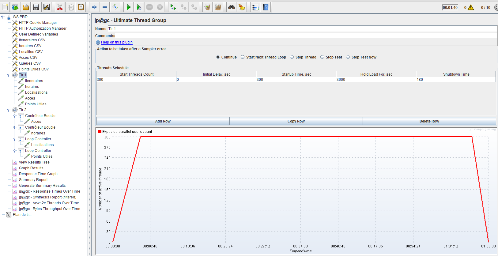
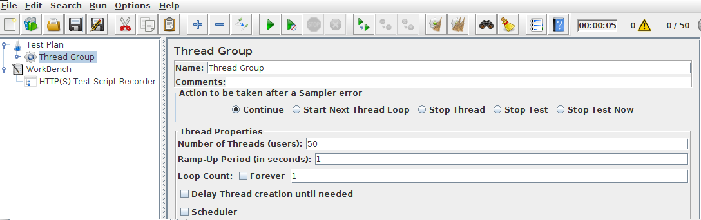
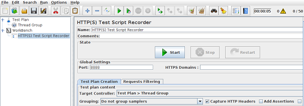
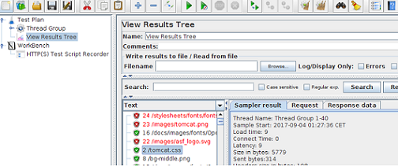
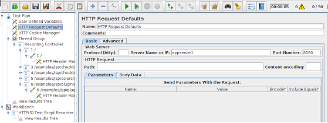

## Installation
------------------------------------------
#### JMeter Plugins
First of all, download plugins-manager.jar and put it into lib/ext.  Install theses interesting plugins:

- **Customer Thread Groups** : Stepping Thread Group and Concurrency Thread Group. 

- **3 Basic Graphs**
- **5 Additional Graphs**
- **Synthesis Report**
- **jpgc Standard Set** 
  
- **PerfMon** 
-- Install Server Agent on remote machines
-- See: https://jmeter-plugins.org/wiki/PerfMon/

## Scenarii Configuration
------------------------------------------
### How to Record Senariis 

Create and Configure a Thread Group:  

set the number of simultanuous users

Create a recorder:  

Set Controler target to the created thread-group

Configure the browser proxy:  
proxy as localhost:8888

### JMeter

Thread : virtual user

#### Result tree 
Test Plan>Add>Listener>View Results Tree

#### HTTP Request Defaults

#### User Defined Variables

  https://guide.blazemeter.com/hc/en-us/articles/207421395-Using-User-Defined-Variables
  
#### CSV Data Set Config

  https://guide.blazemeter.com/hc/en-us/articles/206733689-Using-CSV-DATA-SET-CONFIG

    $ cat ids.txt
    23238092
    0928274
    8823900232-236

Define a user variable **date**. And var name for CSV data is **id**.

Finally define Request with path

    /${id}-${date}/maps/api/geocode/xml?address=1600+Amphitheatre+Parkway,+Mountain+View,+CA&sensor=false
  
#### Timers
Timer has scope. If the timer is defined in threadGroup level, a delay is made in each request of 
the threadGroup.

To insert a delay between loops,

    Threadgroup
    >>Loop
    >>>>req 
    >>Simple Controller
    >>>>constant timer
    >>>>any dummy sampler (say debug sampler, or a http request url) 

  
#### run JMeter in batch

   ./jmeter -n -t ~/magOS/documentation/files/Mysql-JDBC-Test.jmx

## Examples
------------------------------------------
WS Scenario example: [here](files/JMeter-TestPlanWS.jmx)

## Report Generation
------------------------------------------
Generate an HTML report. see: http://jmeter.apache.org/usermanual/generating-dashboard.html

For each listner set this:

     Write result To File: D:\ABR\APP\results\app-perfs.jtl

Update Files: 

    reportgenerator.properties
	user.properties
    
	see: 
    https://jmeter.apache.org/usermanual/generating-dashboard.html

After end of Load test,  the file gaia-perfs.jtl is generated, to generate report:

    .\jmeter.bat -g D:\ABR\GAIA\results\gaia-perfs.jtl -o D:\ABR\GAIA\reports\Tirs1

## References
------------------------------------------
- https://www.digitalocean.com/community/tutorials/how-to-use-jmeter-to-record-test-scenarios

