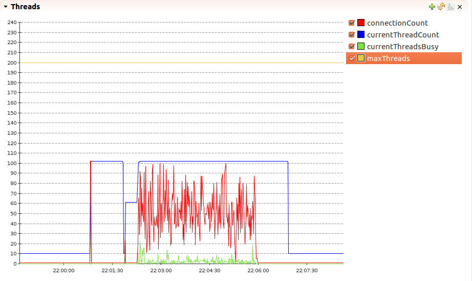
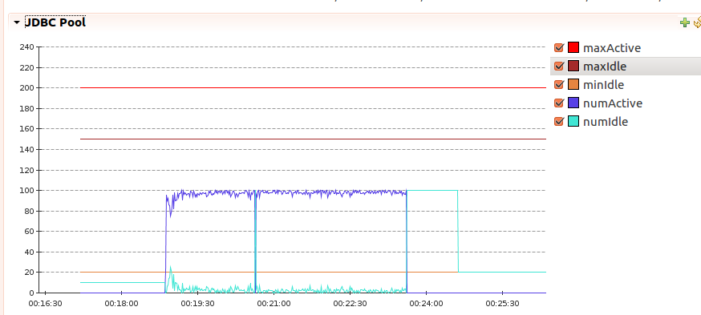
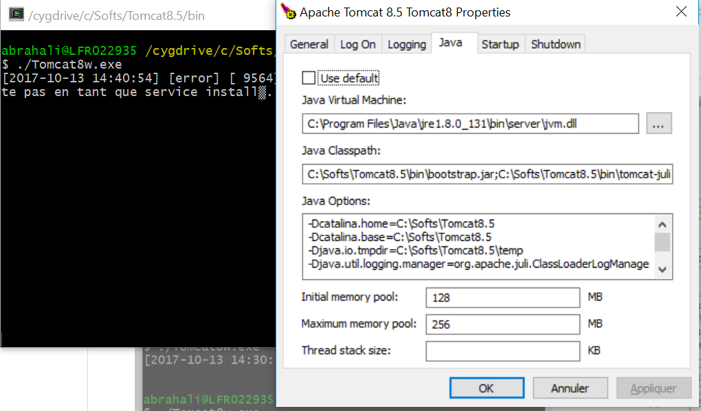

## Tomcat

**Overload Java Security Policy or Ext lib**  
Add to _setenv.sh_  
```sh
    CATALINA_OPTS="... -Djava.ext.dirs=jre/lib/ext -Djava.security.policy=jre/lib/security/java.policy"
```

**TrustStore**  
Add this options to _CATALINA_OPTS_  
```sh
    -Djavax.net.ssl.trustStore=/path/truststore.jks 
    -Djavax.net.ssl.trustStorePassword=**** 
    -Djavax.net.ssl.trustStoreType=JKS
```

**jvmRoute**: server.xml.  
Used by load balancer to enable session affinity. Il must be unique accros tomcat instances.
 

**Activate HTTPS (Tomcat 8)**  
```xml
    <Connector port="10080" protocol="HTTP/1.1"
       connectionTimeout="20000"
       redirectPort="8443" 
       address="safp0180"/>
 
    - NIO Protocol : use JSSE format(keyStore) 
    <Connector
           protocol="org.apache.coyote.http11.Http11NioProtocol"
           port="8443" maxThreads="200"
           scheme="https" secure="true" SSLEnabled="true"
           keystoreFile="${catalina.base}/conf/ssl/server.jks" keystorePass="changeit"
           clientAuth="false" sslProtocol="TLS"/>
    
    - APR Protocol : use OpenSSL format. Best perfs. but ou must compile!. see below 
    <Connector
           protocol="org.apache.coyote.http11.Http11AprProtocol"
           port="8443" maxThreads="200"
           scheme="https" secure="true" SSLEnabled="true"
           SSLCertificateFile="${user.home}/conf/ssl/server-cert.pem"
           SSLCertificateKeyFile="${user.home}/conf/ssl/server-key.pem"
           SSLVerifyClient="optional" SSLProtocol="TLS"/>
    <Connector port="10099" protocol="AJP/1.3" redirectPort="8443" address="safp0180" />
```

**SSL Support - APR/Native**  
When APR/native is enabled, the HTTPS connector will use a socket poller for keep-alive, 
increasing scalability of the server.  
1. You must activate it in server.xml
```sh
  <Listener className="org.apache.catalina.core.AprLifecycleListener" SSLEngine="on" />
```
2. and install/compile native APR. complicated!  
see: https://blog.netapsys.fr/optimiser-tomcat-installation-de-apache-tomcat-native/


**No Blocking Http Connector - NIO (Tomcat 6 and 7)**
> By default, HTTP connector in Tomcat6 and Tomcat7 is blocking connector(BIO). To serve 100 concurrent users, 
> it requires 100 actives threads(maxThreads if not set, is 200 by default).  To use no blocking connector(NIO): 
```xml
   <Connector maxThreads="1000" port="8080" protocol="org.apache.coyote.http11.Http11NioProtocol" .../>
```
> From tomcat8, HTTP connector is NIO by default. wich uses a shared thread pool.


### Rotation des logs
Install Package  
  
    apt install logrotate

Config:  
/etc/logrotate.conf includes all scripts in the/etc/logrotate.d/ 

```
# cat /etc/logrotate.d/tomcat
/opt/tomcat-8.5/logs/catalina.* {
        daily        
		dateext
        copytruncate
        missingok
        rotate 14    
        compress
}

# cat /etc/cron.daily/logrotate
/usr/sbin/logrotate /etc/logrotate.conf
```
Run logrotate in verbose mode:  

    /usr/sbin/logrotate -v /etc/logrotate.conf

### Logs
Ajout d'un filter/appender: editer _conf/logging.properties_
```
handlers = ..., 5jersey.org.apache.juli.FileHandler

5jersey.org.apache.juli.FileHandler.level = FINE
5jersey.org.apache.juli.FileHandler.directory = /myapp/traces
5jersey.org.apache.juli.FileHandler.prefix = app-jersey.

com.sun.jersey.api.container.level = FINE
com.sun.jersey.api.container.handlers = 5jersey.org.apache.juli.FileHandler
```

Log All in debug

    .level = FINE
	

## Tomcat 8
###  JDBC Connection Pool Oracle
Add to server.xml

```xml
 <GlobalNamingResources>
    <Resource name="jdbc/myDS" auth="Container"
       type="javax.sql.DataSource" driverClassName="oracle.jdbc.OracleDriver"
       url="jdbc:oracle:thin:@127.0.0.1:1521:mysid"
       username="scott" password="tiger" maxTotal="20" maxIdle="10" maxWaitMillis="-1"
	   removeAbandonedTimeout="180" 
       removeAbandoned="true" 
       logAbandoned="true" 
       testOnBorrow="true" 
       validationQuery="SELECT 1"
       factory="org.apache.tomcat.jdbc.pool.DataSourceFactory"/>
```

**Deprecated/New attributes**  
  maxActive -> maxTotal  
  maxWait -> maxWaitMillis

**Move from commons-dbcp to tomcat-jdbc-pool**: resolve Already created exception
```sh
    factory="org.apache.tomcat.jdbc.pool.DataSourceFactory"
```

###  JDBC Connection Pool MySQL
add to server.xml ou in context.xml(deploy the DS on all applications)

```xml
 <GlobalNamingResources>
    <Resource
    	  name="jdbc/mywikiDS"
    	  auth="Container"
    	  type="javax.sql.DataSource"
    	  factory="org.apache.tomcat.jdbc.pool.DataSourceFactory"
    	  initialSize="10"
    	  maxActive="200"
    	  maxIdle="150"
    	  minIdle="20"
    	  timeBetweenEvictionRunsMillis="34000"
    	  minEvictableIdleTimeMillis="55000"
    	  validationQuery="SELECT 1"
    	  validationInterval="36000"
    	  testOnBorrow="true"
    	  removeAbandoned="true"
    	  removeAbandonedTimeout="60"
          logAbandoned="false" 
          username="mywiki" password="changeit" 
    	  driverClassName="com.mysql.jdbc.Driver"
          url="jdbc:mysql://localhost:3306/mywikidb"
     />

   <Host...>   
    <Context docBase="simple-jee" path="/simple-jee" reloadable="true">
	  <ResourceLink name="jdbc/mywikiDS" global="jdbc/mywikiDS"
                        type="javax.sql.DataSource"/>
 	</Context>


```
see : <http://www.codingpedia.org/ama/tomcat-jdbc-connection-pool-configuration-for-production-and-development>


## Tomcat 7
**Preventing database connection pool leaks**
```sh
  removeAbandoned="true"
  removeAbandonedTimeout="600"
  logAbandoned="180"
  removeAbandonedTimeout="600" :  
              en seconds. recyclage des connections. Si trop bas, risque de recycler une 
              connection encore active, car la lecture de ResultSet n'est pas prise en compte.
								
  logAbandoned="true" : 
              Logging of abandoned connections, adds overhead for every connection borrowing, 
              because a stack trace has to be generated. The default value is false.
```

**Postgres**
- Copy the Postgres JDBC jar to $CATALINA_HOME/lib
- Datasource

```xml
<Resource name="jdbc/myDS" auth="Container" type="javax.sql.DataSource"
       username="postgres"
       password="postgres"
       driverClassName="org.postgresql.Driver"
       url="jdbc:postgresql://localhost:5432/yourDatabaseName"
       maxTotal="25"
       maxIdle="10"
       validationQuery="select 1" /> 
```
- **validationQuery**: validate connections before they are returned to the application. 
  needed? When a database server rebo	ots, or there is a network failure! 


## Tomcat Security
MUST SEE : https://www.owasp.org/index.php/Securing_tomcat

### Disable SSL renegociation 
this vulnerability may allow DDOS.  
Test if renotiation is enabled  

    $ openssl s_client -connect localhost:443
    [snip... a lot of openssl output]
    ---
    HEAD / HTTP/1.0
    R
    RENEGOTIATING
    28874:error:1409E0E5:SSL routines:SSL3_WRITE_BYTES:ssl handshake failure:s3_pkt.c:530:

Enter "HEAD / HTTP/1.0" newline and "R". if response:
* Http request completes, that means that renegotiation is enabled.
* if failure => renogociation is disabled
* if timeout => SSL deals with renegociation

see : https://blog.ivanristic.com/2009/12/testing-for-ssl-renegotiation.html  

To disable renogociation in NIO(style JSSE) protocle, modify connector in server.xml, 
allowUnsafeLegacyRenegotiation=false


### Eliminate banner grabbing in Apache Tomcat
Access to http://localhost:8080/notFound will show Tomcat Version (eg Apache Tomcat/8.0). To Eliminate it : 

1. Modify server.xml : add server="XYZ" property to connector
```
   <Connector port="8080" protocol="HTTP/1.1"
	    ...
        server="dServer" /> 
```
2. Suppress Version from catalina.jar
```
backup lib/catalina.jar

jar xf catalina.jar org/apache/catalina/util/ServerInfo.properties
ou
zip -x catalina.jar org/apache/catalina/util/ServerInfo.properties

Replace 
  server.info=Apache Tomcat 8.0.x.x/x
  server.number=8.0.1.2
By
  server.info=
  server.number=0.0.0.0
  
jar uf catalina.jar  org/apache/catalina/util/ServerInfo.properties
ou
zip -u catalina.jar  org/apache/catalina/util/ServerInfo.properties

rm org/apache/catalina/util/ServerInfo.properties

```

### Suppressing StackTraces on HTTP 500 Errors 
In web.xml, add error-page tag:
```
<error-page>
    <error-code>500</error-code>
    <location>/WEB-INF/jsp/common/error.jsp</location>
</error-page>
```

### Encrypting passwords in Tomcat
Generate encrypted password

    ./digest.sh -a sha-256 secret
	./digest.sh -a md5 secret  : for MD5
	
To use encrypted pasword in tomcat-users.xml, add digest to server.xml

	<Realm className="org.apache.catalina.realm.UserDatabaseRealm"
       resourceName="UserDatabase"
       digest="sha-256" />

digest.sh cannot be used to encrypt passwds for DataSource resource	   
	   
	   
## Monitoring Performance tuning
**Activate remote JMX**  
Edit _bin/setenv.sh_ with:  
```sh
export CATALINA_OPTS="-Dcom.sun.management.jmxremote \
                  -Dcom.sun.management.jmxremote.port=3333 \
                  -Dcom.sun.management.jmxremote.ssl=false  \
                  -Dcom.sun.management.jmxremote.authenticate=true\
                  -Dcom.sun.management.jmxremote.password.file=../conf/jmxremote.password\
                  -Dcom.sun.management.jmxremote.access.file=../conf/jmxremote.access"
```
Create files : 

    $ echo "jmxuser readonly" >>  jmxremote.access
    $ echo "jmxuser passwd123" >> jmxremote.password 
    $ chmod go-rwx jmxremote.password

Or Without credentials:
```sh
	-Dcom.sun.management.jmxremote
	-Dcom.sun.management.jmxremote.port=6666
	-Dcom.sun.management.jmxremote.ssl=false
	-Dcom.sun.management.jmxremote.authenticate=false
```

**Probem**: JConsole, connection refused to 127.0.0.1  
Solution: add also this option to the remote JVM, -Djava.rmi.server.hostname=hostIp

**Simple load test simulation** 
  
    ab -n 100000 -c 100 http://localhost:8080/

### JMX Proxy Servlet
Prereq:
* manager application installed
* role manager-jmx
```xml
# cat tomcat-users.xml
  <role rolename="manager-jmx"/>
  <role rolename="manager-gui"/>
  <user username="tomcat" password="changeit" roles="manager-gui,manager-jmx"/>
```
Heap Memory:  
<http://localhost:8080/manager/jmxproxy/?get=java.lang:type=Memory&att=HeapMemoryUsage>

Query All :  
<http://localhost:8080/manager/jmxproxy/?qry=*:*>

Datasource:  
http://localhost:8080/manager/jmxproxy/?qry=Catalina:type=DataSource,host=localhost,context=/examples,
class=javax.sql.DataSource,name=%22jdbc/hellodb%22

### Monitoring FAQ
[FAQ Monitoring](https://wiki.apache.org/tomcat/FAQ/Monitoring)  

### Monitoring using Java Mission Control(JMC)
#### Thread Pool
ThreadPool(Not using Executor) :   

    Catalina:name=http-nio-8080,type=ThreadPool  
    Catalina:name=ajp-nio-8080,type=ThreadPool  
    attributs:
          currentThreadsBusy
          maxThreads
          currentThreadCount
          connectionCount"



Mbean name can be "http-bio-8080" on tomcat 6 & 7. 

If using Executor: 

    JMX Bean: Catalina:type=Executor,name=[executor name]
    Attributes: poolSize, activeCount 

Recommandation : In Tomcat 7 you must use Executor.
 

#### DataSource
    JMX Bean: Catalina:type=DataSource,context=[context name],
                        host=[hostname],class=javax.sql.DataSource,name="[JNDI name]"
    Attributes: numActive, numIdle



#### Request Throughput
    JMX Bean: Catalina:type=GlobalRequestProcessor,name="[depends]"
    Attributes: bytesSent, bytesReceived, errorCount, maxTime, requestCount
    Operations: resetCounters 

#### Sessions
    JMX Bean: Catalina:type=Manager,context=[context name],host=[hostname]
    Attributes: activeSessions, sessionCounter, expiredSessions

## Tomcat on Windows
Windows service howto:   
   https://tomcat.apache.org/tomcat-8.0-doc/windows-service-howto.html
   
Tomcat Configuring GUI.
```
  bin/Tomcat8w.exe //ES//‎service-name  (Attention pas despace dans Tomcat 8)
  
```



