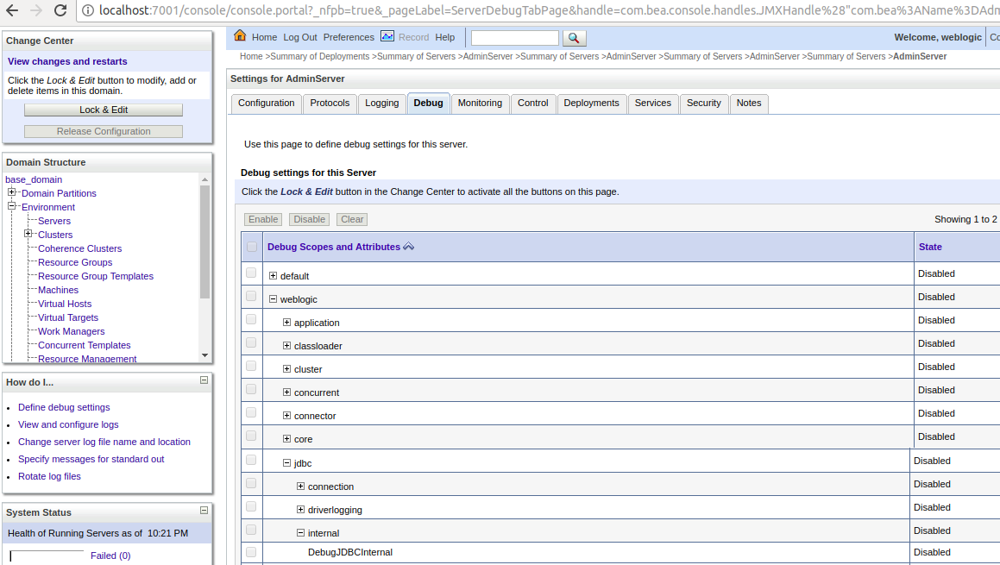
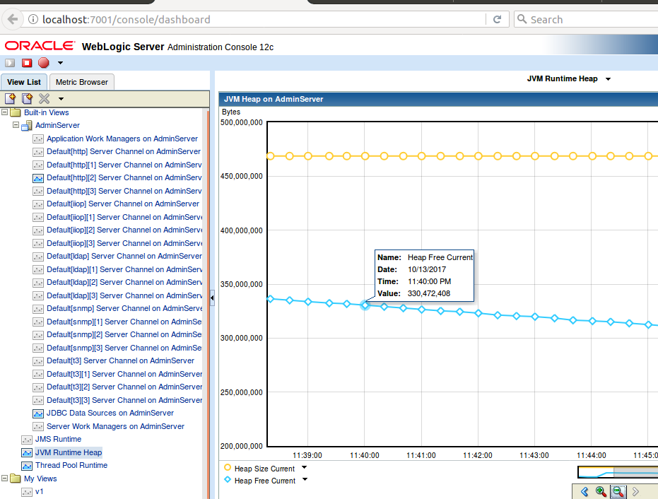

## Weblogic 12

### Installation
Installer
```sh
java -jar fmw_12.2.1.2.0_wls_quick.jar ORACLE_HOME=/opt/weblogic
java -jar fmw_12.2.1.2.0_wls_quick.jar -help
```

Create the Domain, 
```sh
oracle_common/common/bin/config.sh
```
This wizard can create AdminServer( port 7001), nodemanager, managed nodes

### Tree
Domain:  
/opt/weblogic/user_projects/domains/base_domain

### Config Vars
-Dweblogic.RootDirectory=path : root directory, contains config/config.xml, servers etc	 

### Console
Url  
  http://localhost:7001/console

Port

Username/password


### Config
Start Weblogic without password prompt
```
  edit: user_projects/domains/base_domain/servers/AdminServer/security/boot.properties
     sername=weblogic
     password=weblogic1
```

Node Manager   
```
 $ cat base_domain/nodemanager/nodemanager.properties
   ListenPort=5556
```

### Arret/relance

**Stop/start**
AdminServer (Manager)
```sh
user_projects/domains/base_domain/bin/startWebLogic.sh
```

Node Manager
```sh
user_projects/domains/base_domain/bin/startNodeManager.sh
```

### JVM Options

base_domain/startManagedWebLogic.sh
  

**Stop/start of server**

### Logs

### Debugging Weblogic
see :  
https://docs.oracle.com/middleware/1212/wls/JDBCA/monitor.htm#JDBCA259  
http://weblogic-wonders.com/weblogic/2010/11/18/weblogic-server-debug-flags.


**Activate Debug SQL using JVM Options**  
```sh
-Dweblogic.debug.DebugJDBCSQL=true 
-Dweblogic.log.StdoutSeverity="Debug"
```
These debug flags are added in the JAVA_OPTIONS in the start script.  


**Activate Debug using WLST**
```sh
user='user1'
password='password'
url='t3://localhost:7001'
connect(user, password, url)
edit()
cd('Servers/myserver/ServerDebug/myserver')
startEdit()
set('DebugJDBCSQL','true')
save()
activate()
```

**Activate Debug using Console**  


#### Configuration des rôles et utilisateurs 
    Domain Structure > Security Realms > myrealm
    
    Onglet Users and Groups > Groups : add group « myAppUsers »

    Onglet Roles and Policies > Realm Roles :
    Domain > DName > Roles
    Créer rôle « myAppUsers »
    Dans « Domain Scoped Role Conditions » 
    Ajout de la condition Group : myAppUsers 

    Onglet Users and Groups > Users :
    Ajout de l’utilisateur  « safar »
    Saisie du mot de passe
    Affecter l’utilisateur au groupe « myAppUsers »

	Tous les autres paramètres du realm/group/user/role laissés par défaut.

#### Apache/Weblogic 
	<VirtualHost 10.0.0.52>
		ServerName www.app1.safar.com
		 <IfModule mod_weblogic.c>
			WebLogicCluster app1-wls1.safar.com:59105,app1-wls2.safar.com:59105
			<Location />
					SetHandler weblogic-handler
			</Location>
		</IfModule>
		ErrorLog /logs/apache/app1_error_log
		CustomLog /logs/apache/app1_access_log combined
	</VirtualHost>


## Tuning of Performances
1. JVM – Percent of time in Garbage Collection  
CG is a stop world 

2. Execute Thread Counts  

3. Workmanager Thread usage  

4. JDBC  
Current Capacity: pool saturation  
Current Capacity High  
Connection delay time: indicate database responsiveness  

Ref  
https://www.dynatrace.com/blog/top-10-weblogic-performance-metrics-proactively-monitor-server-farm/

## Tuning JDBC Pool

- Maximum Capacity
- Minimum Capacity : to be at least half (50%) of MAX so that the connection pool cannot shrink below this value.
  Used only for connection pool shrinking calculations.
- Initial Capacity : to be at least quarter (25%) of MAX. This is the initial number of connections 
  created when the application server is started
- Inactive Connection Timeout:
  Inactive connection in WebLogic Server will be releases and back into the connection pool if this value set 
  more than 0. Recommendation for this config is specific value in seconds, so if found leaked connections that
  were not correctly closed by the application will be handle via this feature.
- Shrink Frequency : (Harvest Interval) to 1800 (30 minutes). The number of seconds to wait before shrinking a 
  connection pool that has incrementally increased to meet demand. When set to 0, shrinking is disabled. 
  Shrinking means that WebLogic drop some connections from the data source when a peak usage 
  period has ended, freeing up WebLogic Server and DBMS resources. When set to 0, shrinking is disabled.
- Set Connection Creation Retry Frequency to 120 (2 minutes)
- Set Test Frequency to 120 (2 minutes). This is to poll the database to test the connection. This defaults 
  to “SELECT 1 FROM DUAL” which bypasses the buffer cache so it’s not bad.
- Set Seconds to trust an Idle Pool Connection to 10.
- Cache for prepared statements must be set to 20 or higher. Setting this higher should be discussed with your DBA. 
  The total number of cached cursors would be the cache setting*number of connections in pool*number of servers in 
  cluster. This should be set very carefully. That calulation equates to the number of open cursors allowed per 
  session, so if it is set too low then cursors are repeatedly closed and opened. This leads to excessive hard parsing
  of SQL statements which can also lead to performance degradation. In fact “Bad Use of Cursors” is the number 2 point
  on the “Top Ten Mistakes” list, and it says that this has an order of magnitude impact in performance, 
  and is totally unscalable.  
  Be carefaul : ORA-01000 maximum open cursors exceeded  
    sql > SELECT value FROM v$parameter WHERE name = 'open_cursors';

https://timegatetechnologies.wordpress.com/2013/10/22/weblogic-jdbc-connection-pool-misconfiguration-and-how-it-can-cause-serious-performance-problems/


## WLDF

1. Copy WL_HOME\server\lib\console-ext\diagnostics-console-extension.jar into DOMAIN-DIR/console-ext  
2. Restart the Administration Server  
3. **Activate diagnostics console extension**  
On console: Preferences>Extensions>diagnostics-console-extension

Dashboard  
http://localhost:7001/console/dashboard  
Graphing Data With the Dashboard. you can access it from Home page.
  


## WLST
```sh
$java -cp /opt/weblogic/wlserver/server/lib/weblogic.jar weblogic.WLST

Connect To Admin Server:
  wls:/offline> connect('weblogic','weblogic1', 't3://localhost:7001')
  
Runtime commands
  wls> domainRuntime()  
  wls> cd('ServerRuntimes/myServer1/JVMRuntime/myServer1')

Commands :
  wls> ls()
   
```


