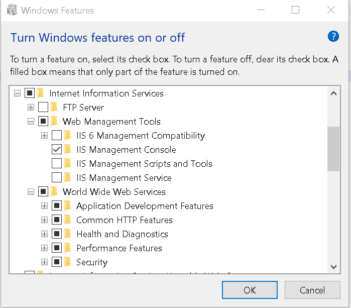
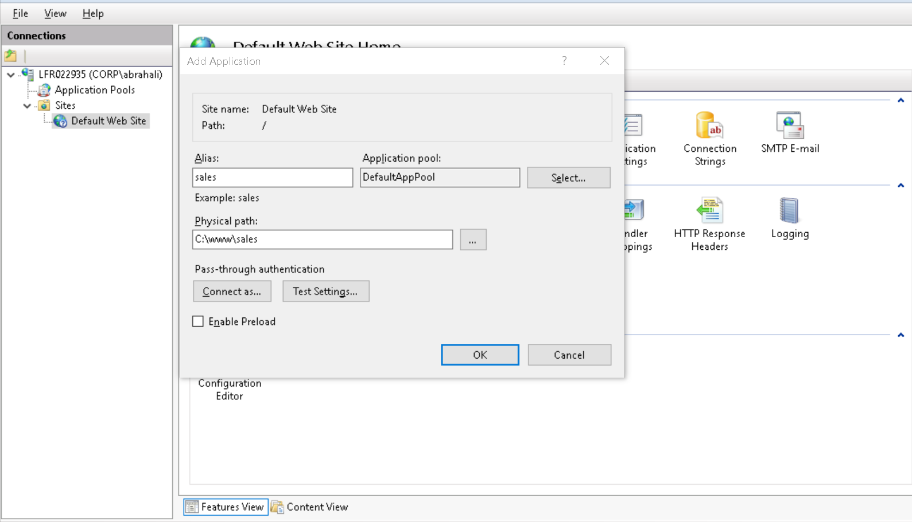

## Windows

**Tail -f Equivalent** :  
Use PaowerShell

    Get-Content -Path .\catalina.2017-11-20.log -Wait -Tail 10
	
**Ctr+Alt+Sup on remotre RDP**

	 Ctrl+Alt+End 
	 
### Power Shell

## IIS
#### Instal IIS	on Windows 10
Config panel -> Programs -> Tur windows fetures on/off

Console IIS: http://localhost/iishelp/iis/misc/default.asp

#### IIS Manager 

In the Start Search box, type **inetmgr**.
   

   
#### Add a web site

1. Open IIS Manager. 
2. In the Connections pane, right-click the Sites node in the tree, and then click Add Web Site.

#### To start or stop a Web site
1. Open IIS Manager. 
2. In Features View, in the Actions pane, use one of the following procedures:
2.1 Under Manage Web Site, click Start to start the Web site.
2.2 Under Manage Web Site, click Stop to stop the Web site.

####  Configure HTTPS
In **Bindings...**

####  Virtual Host
In **Bindings...**

