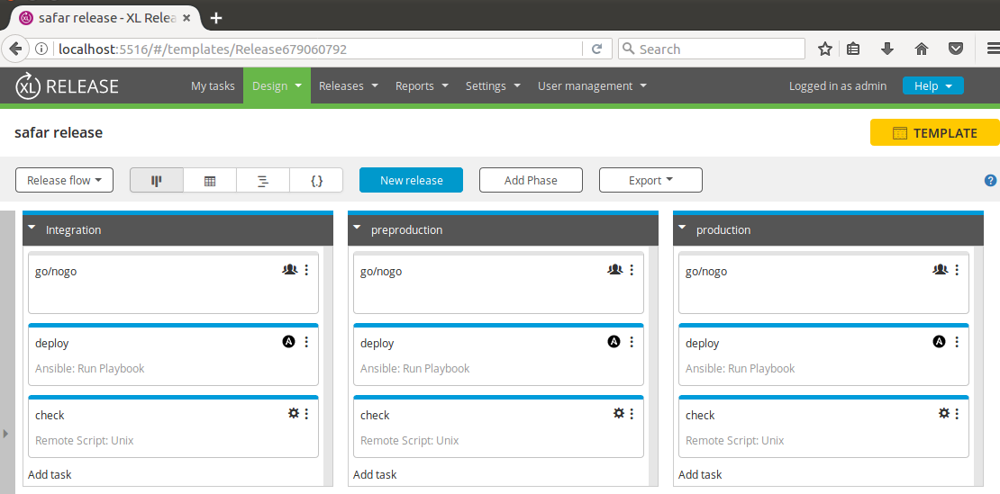
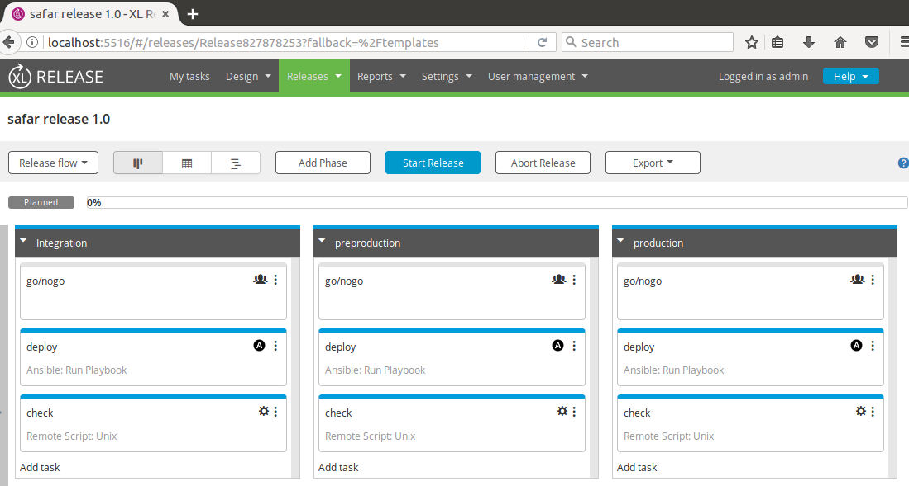

### XL Release
---- 
XL Release is a DevOps tool for deployment orchestration.

**Installation**
> Download the trial server version. to install just do : "run.sh -setup"

**Configure the server containing ansible playbooks**
> Settings > Shared configuration: and choose : Unix Host : SU username: root, SU password:

**Create the template**

**Create Release**

